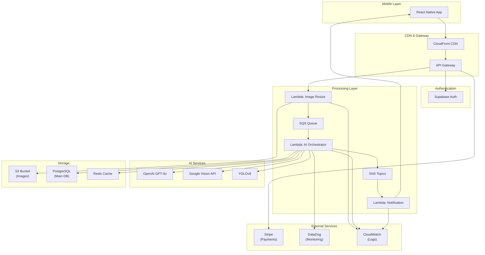

# System Design for AI Drink Logging System

Author: Nazar Pasika
Date: June 21, 2025

## Overview

A mobile-first application that uses AI to automatically detect and log drinks from user uploaded photos, supporting millions of users with a freemium monetization model.


## 1. System Architecture

### Core Components

1. **Mobile Application** (React Native)
2. **API Gateway** (AWS API Gateway + CloudFront)
3. **Authentication Service** (Supabase Auth)
4. **Image Processing Pipeline** (AWS Lambda + S3)
5. **AI Inference Service** (Hybrid Multi-Provider Architecture)
6. **Database Layer** (PostgreSQL + Redis Cache)
7. **Queue System** (AWS SQS + SNS)
8. **Payment Processing** (Stripe)
9. **Analytics & Monitoring** (CloudWatch + DataDog)

### System Architecture Diagram



### Image Processing Flow

**Implementation Approach:**

1. **Image Upload & Validation**
   - Accept images via API Gateway 
   - Validate file type (JPEG, PNG) and size limits (max 10MB)
   - Generate unique upload ID for tracking

2. **Compression & Optimization**
   - Resize images while maintaining aspect ratio
   - Convert to unified format (JPEG) for consistency and transparency support
   - Store original and optimized versions in S3

3. **Deduplication System**
   - Calculate SHA-256 hash of image content (not filename)
   - Check Redis cache for existing hash matches
   - If duplicate found, return cached results instead of reprocessing
   - Store hash-to-result mapping with TTL of 30 days

4. **CDN Integration**
   - Configure CloudFront distribution with S3 origin
   - Set cache headers for optimized images 
   - Implement cache invalidation for updated images

5. **Async Processing Pipeline**
   - Route images through SQS queue 
   - Implement exponential backoff for retry attempts (3 retries max)
   - Use separate queues for different image sizes/complexity

6. **Error Handling & Recovery**
   - Dead Letter Queue for failed processing after max retries
   - Alert system for DLQ items requiring manual intervention
   - Automatic retry with exponential backoff
   - Graceful degradation when services are unavailable

### Scalability Architecture

- **Horizontal Scaling**: Auto scaling Lambda functions and ECS containers
- **Caching Strategy**: 
  - Redis for frequently accessed data 
  - CloudFront for image caching
- **Rate Limiting**: API Gateway throttling 

## 2. AI Model Strategy 

### Hybrid Multi-Provider Architecture

The AI model strategy uses a hybrid approach that combines multiple AI providers and model types to optimize for accuracy, cost, and reliability. This architecture prevents vendor lock-in while ensuring consistent service availability.

**Primary Provider: OpenAI GPT-4o**
- **Use Case**: Initial drink identification and complex scene analysis

**Secondary Provider: Google Vision API**
- **Use Case**: Backup for GPT-4o failures, label/text detection on packaging

**Custom Models**
- **YOLOv8 model**: Volume estimation and container classification

**Cost Optimization Strategy:**
- Route simple images (clear single drinks) to cheaper models first
- Escalate to premium models only for low-confidence results
- Monitor monthly spend vs accuracy to optimize routing thresholds

### Edge Case Handling

1. **Multiple Drinks**: Return array of detected drinks with confidence scores
2. **Unclear Photos**: Request re-upload with specific guidance
3. **Unknown Drinks**: Allow manual entry 

### 3. Paywalling and Monetization

### Freemium Model

**Free Tier (3 uploads/day):**
- Basic drink detection
- Simple logging
- Limited history (30 days)

**Premium Tier**
- Unlimited uploads
- Advanced analytics and trends
- Export capabilities
- Priority processing

### Implementation Approach

**Phase 1: Core Infrastructure Setup**
1. **Database Schema Design**: Create user_subscriptions table with tier tracking, quota management, and Stripe integration fields
2. **Redis Implementation**: Set up quota counters with TTL-based reset logic for daily limits
3. **API Middleware**: Implement quota checking middleware that intercepts upload requests before processing
4. **Stripe Integration**: Configure webhook endpoints for real-time subscription status updates

**Phase 2: Quota Enforcement System**
1. **Real-time Counter**: Use Redis with daily expiration for upload tracking
2. **Graceful Degradation**: When quota exceeded, redirect to manual entry flow instead of blocking
3. **Quota Reset Logic**: Implement cron job to reset counters at user's local midnight
4. **Edge Case Handling**: Account for timezone differences and daylight saving time

**Phase 3: Monetization Optimization**
**Caching Strategy**: Cache user tier status in Redis to avoid database hits on every request
- **Rate Limiting**: Implement different rate limits for free vs premium users

### Implementation Strategy

**Usage Tracking:**
```sql
CREATE TABLE users (
  id UUID PRIMARY KEY,  
  email VARCHAR(255) UNIQUE NOT NULL,
  display_name VARCHAR(100),
  avatar_url TEXT,
  created_at TIMESTAMP WITH TIME ZONE DEFAULT NOW(),
  updated_at TIMESTAMP WITH TIME ZONE DEFAULT NOW(),
  last_active_at TIMESTAMP WITH TIME ZONE DEFAULT NOW(),
  onboarding_completed BOOLEAN DEFAULT FALSE,
  timezone VARCHAR(50) DEFAULT 'UTC',
  language VARCHAR(10) DEFAULT 'en',
  status VARCHAR(20) DEFAULT 'active', -- active, suspended, deleted
  
  -- Analytics fields
  total_uploads INTEGER DEFAULT 0,
  total_drinks_logged INTEGER DEFAULT 0,
  streak_days INTEGER DEFAULT 0,
  longest_streak INTEGER DEFAULT 0,
  last_upload_date DATE,
  
  -- Referral system
  referral_code VARCHAR(20) UNIQUE,
  referred_by_user_id UUID REFERENCES users(id),
  referral_count INTEGER DEFAULT 0,
  
  -- Indexes
  INDEX idx_users_email (email),
  INDEX idx_users_referral_code (referral_code),
  INDEX idx_users_status (status),
  INDEX idx_users_last_active (last_active_at)
);

-- User subscriptions and quotas
CREATE TABLE user_subscriptions (
  id UUID PRIMARY KEY DEFAULT gen_random_uuid(),
  user_id UUID NOT NULL REFERENCES users(id) ON DELETE CASCADE,
  
  -- Subscription details
  tier VARCHAR(20) NOT NULL DEFAULT 'free', -- free, premium, enterprise
  status VARCHAR(20) NOT NULL DEFAULT 'active', -- active, past_due, canceled, trialing
  
  -- Stripe integration
  stripe_customer_id VARCHAR(100),
  stripe_subscription_id VARCHAR(100),
  stripe_price_id VARCHAR(100),
  
  -- Billing cycle
  current_period_start TIMESTAMP WITH TIME ZONE,
  current_period_end TIMESTAMP WITH TIME ZONE,
  trial_start TIMESTAMP WITH TIME ZONE,
  trial_end TIMESTAMP WITH TIME ZONE,
  
  -- Usage tracking
  monthly_uploads INTEGER DEFAULT 0,
  upload_quota INTEGER DEFAULT 12, -- 3 per day for free tier
  quota_reset_date DATE DEFAULT CURRENT_DATE,
  last_quota_reset TIMESTAMP WITH TIME ZONE DEFAULT NOW(),
    
  created_at TIMESTAMP WITH TIME ZONE DEFAULT NOW(),
  updated_at TIMESTAMP WITH TIME ZONE DEFAULT NOW(),
  
  -- Indexes
  INDEX idx_user_subscriptions_user_id (user_id),
  INDEX idx_user_subscriptions_stripe_customer (stripe_customer_id),
  INDEX idx_user_subscriptions_tier_status (tier, status),
  INDEX idx_user_subscriptions_quota_reset (quota_reset_date),
  
  -- Constraints
  CONSTRAINT valid_tier CHECK (tier IN ('free', 'premium', 'enterprise')),
  CONSTRAINT valid_status CHECK (status IN ('active', 'past_due', 'canceled', 'trialing', 'incomplete'))
);
```

**Subscription Management:**
- **Stripe** for payment processing and subscription management
- **Webhook integration** for real-time subscription updates
- **Grace period** of 3 days for failed payments

### Upgrade Flow

1. **Soft Paywall**: Show "3/3 uploads used" with upgrade prompt
2. **Value Demonstration**: Show what they'd unlock with premium
3. **Free Trial**: 7-day premium trial to demonstrate value

## 4. Testing Accuracy & Improving Failed Detections

### Testing System Accuracy

**A/B Testing Framework** 
- Compare model responses on identical images
- Metrics: Accuracy, confidence scores, processing time

**User Feedback Loop**
- Simple thumbs up/down on AI predictions
- Suggest "correction" flow for wrong predictions
- Store corrections in PostgreSQL for model improvement

### Testing User Experience

**Real User Monitoring (RUM) Analysis**
- **Performance Metrics**: Monitor image upload times, AI processing delays, and app crashes
- **Error Tracking**: Capture errors, API failures, and network timeouts
- **User Journey Mapping**: Analyze drop-off points in the drink logging (application) flow

**RUM-Driven Iteration Process**
1. **Weekly RUM Review**: Identify top 3 user pain points from session recordings
2. **Root Cause Analysis**: Determine if issues are UX, performance, or technical
3. **A/B Testing**: Validate improvements with subset of users before full rollout
4. **Success Measurement**: Track improvement in conversion rates and user satisfaction

### Logging & Improving Failed Detections

**Failure Classification System**
```javascript
// Example failure logging structures for different scenarios

// 1. User Correction - Wrong drink identification
{
  image_id: "uuid-001",
  failure_type: "USER_CORRECTION",
  confidence_score: 0.85,
  ai_prediction: {
    drink_name: "Coca-Cola",
    volume: "355ml",
    container_type: "can"
  },
  user_correction: {
    drink_name: "Pepsi Cola",
    volume: "355ml", 
    container_type: "can"
  },
  image_metadata: {
    lighting: "dim",
    angle: "side_view",
    brand_visible: true
  },
  model_used: "gpt-4o",
  correction_reason: "brand_misidentification"
}

// 2. Low Confidence Detection
{
  image_id: "uuid-002", 
  failure_type: "LOW_CONFIDENCE",
  confidence_score: 0.23,
  ai_prediction: {
    drink_name: "unknown_beverage",
    volume: "unknown",
    container_type: "bottle"
  },
  user_correction: {
    drink_name: "Green Tea",
    volume: "500ml",
    container_type: "plastic_bottle"
  },

  model_used: "gpt-4o",
  models_attempted: ["google_vision", "yolov8"]
}

// 3. Multiple Drinks Confusion
{
  image_id: "uuid-003",
  failure_type: "USER_CORRECTION", 
  confidence_score: 0.67,
  ai_prediction: {
    drinks: [
      { drink_name: "Coffee", volume: "354ml" },
      { drink_name: "Water", volume: "500ml" }
    ],
    primary_focus: "coffee"
  },
  user_correction: {
    drinks: [
      { drink_name: "Latte", volume: "354ml" }
    ],
    note: "Only one drink, not two separate drinks"
  },
  image_metadata: {
    multiple_objects: true,
    focus_unclear: true
  },
  model_used: "gpt-4o",
  correction_reason: "multiple_detection_error"
}

// 4. Technical Processing Error
{
  image_id: "uuid-004",
  failure_type: "PROCESSING_ERROR",
  confidence_score: null,
  ai_prediction: null,
  error_details: {
    error_code: "TIMEOUT",
    error_message: "OpenAI API timeout after 30s",
    retry_attempts: 3,
    fallback_attempted: true,
    fallback_result: "google_vision_success"
  },
  image_metadata: {
    file_size: "8.2MB",
    resolution: "4032x3024",
    processing_time: "30000ms"
  },
  model_used: "gpt-4o",
  resolution: "switched_to_backup_model"
}

// 5. Volume Estimation Error  
{
  image_id: "uuid-005",
  failure_type: "USER_CORRECTION",
  confidence_score: 0.78,
  ai_prediction: {
    drink_name: "Orange Juice",
    volume: "250ml",
    container_type: "glass"
  },
  user_correction: {
    drink_name: "Orange Juice", 
    volume: "500ml",
    container_type: "large_glass"
  },
  image_metadata: {
    reference_objects: false,
    hand_visible: true,
    angle: "top_down"
  },
  model_used: "yolov8",
  correction_reason: "volume_underestimation"
}

// 6. No Detection When Drink Present
{
  image_id: "uuid-006",
  failure_type: "USER_CORRECTION",
  confidence_score: 0.15,
  ai_prediction: {
    result: "no_drinks_detected",
    objects_found: ["table", "phone", "keys"]
  },
  user_correction: {
    drink_name: "Clear Soda", 
    volume: "330ml",
    container_type: "glass_bottle"
  },
  image_metadata: {
    drink_transparency: "high",
    background_complexity: "cluttered",
    lighting: "natural"
  },
  model_used: "gpt-4o",
  correction_reason: "transparent_liquid_missed"
}
```

**Automated Monitoring (CloudWatch + Datadog)**
- **Error Rate Alerts**: >5% failures trigger Slack notification
- **Model Degradation**: Monitor when model performance degrades
- **Processing Time Spikes**: Alert on large response times

**Improvement Workflow**
1. **Weekly Review**: Analyze top failure patterns in Datadog dashboard
2. **Model Tuning**: 
   - Update the prompt for most failure types
   - Switch models if competitor consistently outperforms
   - Add specific training data for recurring edge cases

